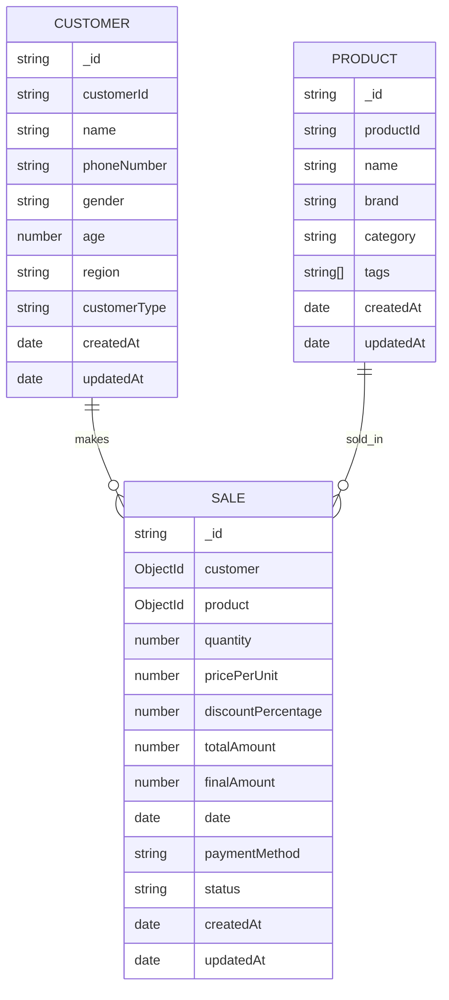

```markdown
# Retail Sales Management System

A comprehensive retail sales management system built with MERN stack (MongoDB, Express.js, React.js, Node.js) with advanced search, filtering, sorting, and analytics capabilities.

## Features

- **Product Management**: CRUD operations for products with categories and brands
- **Customer Management**: Track customer information and purchase history
- **Sales Processing**: Record and manage sales transactions
- **Advanced Search**: Full-text search across products and customers
- **Analytics Dashboard**: Visualize sales data and performance metrics
- **Responsive Design**: Works on desktop and mobile devices
- **Secure Authentication**: JWT-based authentication system
- **Role-based Access Control**: Different permissions for admin and staff

## System Architecture

### ER Diagram



### Technology Stack

- **Frontend**: React.js, Redux, Material-UI, React Query
- **Backend**: Node.js, Express.js
- **Database**: MongoDB with Mongoose ODM
- **Authentication**: JWT (JSON Web Tokens)
- **API Documentation**: Swagger/OpenAPI
- **Deployment**: Heroku (Backend), Vercel (Frontend)

## Data Models

### 1. Product Model

```javascript
{
  productId: String,      // Unique product identifier
  name: String,           // Product name
  brand: String,          // Product brand
  category: String,       // Product category
  tags: [String],         // Product tags for filtering
  price: Number,          // Product price
  stockQuantity: Number,  // Available quantity in stock
  description: String,    // Product description
  imageUrl: String,       // URL to product image
  createdAt: Date,        // Creation timestamp
  updatedAt: Date         // Last update timestamp
}
```

### 2. Customer Model

```javascript
{
  customerId: String,     // Unique customer identifier
  name: String,           // Customer name
  phoneNumber: String,    // Contact number
  gender: String,         // Gender (Male/Female/Other)
  age: Number,            // Customer age
  region: String,         // Geographic region
  customerType: String,   // Regular/Premium/VIP
  email: String,          // Customer email
  address: String,        // Full address
  totalPurchases: Number, // Total amount spent
  loyaltyPoints: Number,  // Loyalty points earned
  lastPurchase: Date,     // Date of last purchase
  createdAt: Date,        // Creation timestamp
  updatedAt: Date         // Last update timestamp
}
```

### 3. Sale Model

```javascript
{
  saleId: String,         // Unique sale identifier
  customer: {             // Reference to Customer
    type: mongoose.Schema.Types.ObjectId,
    ref: 'Customer'
  },
  items: [{               // Array of sold items
    product: {            // Reference to Product
      type: mongoose.Schema.Types.ObjectId,
      ref: 'Product'
    },
    quantity: Number,     // Quantity sold
    price: Number,        // Price per unit
    discount: Number      // Discount applied
  }],
  subtotal: Number,       // Total before tax and discount
  taxAmount: Number,      // Tax amount
  discountAmount: Number, // Total discount
  totalAmount: Number,    // Final amount to pay
  paymentMethod: String,  // Payment method used
  paymentStatus: String,  // Paid/Pending/Failed
  status: String,         // Order status
  notes: String,          // Additional notes
  createdAt: Date,        // Creation timestamp
  updatedAt: Date         // Last update timestamp
}
```

## API Documentation

### Base URL
`https://your-heroku-app.herokuapp.com/api`

### Authentication
All protected routes require a valid JWT token in the Authorization header:
```
Authorization: Bearer <token>
```

### Products API

#### Get All Products
```
GET /products
```
Query Parameters:
- `page` - Page number (default: 1)
- `limit` - Items per page (default: 10)
- `category` - Filter by category
- `brand` - Filter by brand
- `minPrice` - Minimum price
- `maxPrice` - Maximum price
- `inStock` - Filter by stock availability
- `sortBy` - Sort field and order (e.g., `name:asc`, `price:desc`)

#### Get Product by ID
```
GET /products/:id
```

#### Create Product (Admin Only)
```
POST /products
```
Request Body:
```json
{
  "name": "Product Name",
  "brand": "Brand Name",
  "category": "Category",
  "price": 99.99,
  "stockQuantity": 100,
  "description": "Product description",
  "imageUrl": "https://example.com/image.jpg"
}
```

### Customers API

#### Get All Customers
```
GET /customers
```

#### Create Customer
```
POST /customers
```
Request Body:
```json
{
  "name": "John Doe",
  "email": "john@example.com",
  "phone": "1234567890",
  "address": "123 Main St"
}
```

### Sales API

#### Create Sale
```
POST /sales
```
Request Body:
```json
{
  "customerId": "customer123",
  "items": [
    {
      "productId": "prod123",
      "quantity": 2,
      "price": 49.99
    }
  ],
  "paymentMethod": "Credit Card"
}
```

## Setup Instructions

### Prerequisites
- Node.js 16+
- npm 8+ or yarn
- MongoDB 5.0+
- Git

### Backend Setup

1. Clone the repository:
   ```bash
   git clone https://github.com/yourusername/retail-sales-system.git
   cd retail-sales-system/backend
   ```

2. Install dependencies:
   ```bash
   npm install
   # or
   yarn
   ```

3. Create a [.env](cci:7://file:///c:/Users/MANOJ/truestate/retail-sales-system/backend/.env:0:0-0:0) file in the backend directory:
   ```env
   NODE_ENV=development
   PORT=5000
   MONGO_URI=mongodb://localhost:27017/retail-sales
   JWT_SECRET=your_jwt_secret_key
   JWT_EXPIRE=30d
   CORS_ORIGIN=http://localhost:3000
   ```

4. Start the development server:
   ```bash
   npm run dev
   # or
   yarn dev
   ```

### Frontend Setup

1. Navigate to the frontend directory:
   ```bash
   cd ../frontend
   ```

2. Install dependencies:
   ```bash
   npm install
   # or
   yarn
   ```

3. Create a [.env](cci:7://file:///c:/Users/MANOJ/truestate/retail-sales-system/backend/.env:0:0-0:0) file in the frontend directory:
   ```env
   REACT_APP_API_URL=http://localhost:5000/api
   NODE_ENV=development
   ```

4. Start the development server:
   ```bash
   npm start
   # or
   yarn start
   ```

## Deployment

### Backend (Heroku)

1. Create a new Heroku app:
   ```bash
   heroku create your-app-name
   ```

2. Set environment variables:
   ```bash
   heroku config:set NODE_ENV=production
   heroku config:set JWT_SECRET=your_jwt_secret_key
   heroku config:set MONGO_URI=your_mongodb_atlas_uri
   heroku config:set CORS_ORIGIN=https://your-frontend-domain.com
   ```

3. Deploy to Heroku:
   ```bash
   git push heroku main
   ```

### Frontend (Vercel)

1. Install Vercel CLI:
   ```bash
   npm install -g vercel
   ```

2. Login to Vercel:
   ```bash
   vercel login
   ```

3. Deploy:
   ```bash
   vercel --prod
   ```

## Testing

Run tests with:
```bash
# Backend tests
cd backend
npm test

# Frontend tests
cd ../frontend
npm test
```

## Contributing

1. Fork the repository
2. Create your feature branch (`git checkout -b feature/AmazingFeature`)
3. Commit your changes (`git commit -m 'Add some AmazingFeature'`)
4. Push to the branch (`git push origin feature/AmazingFeature`)
5. Open a Pull Request

## License

This project is licensed under the MIT License - see the [LICENSE](LICENSE) file for details.

## Support

For support, email support@retailsales.com or open an issue in the GitHub repository.
```
